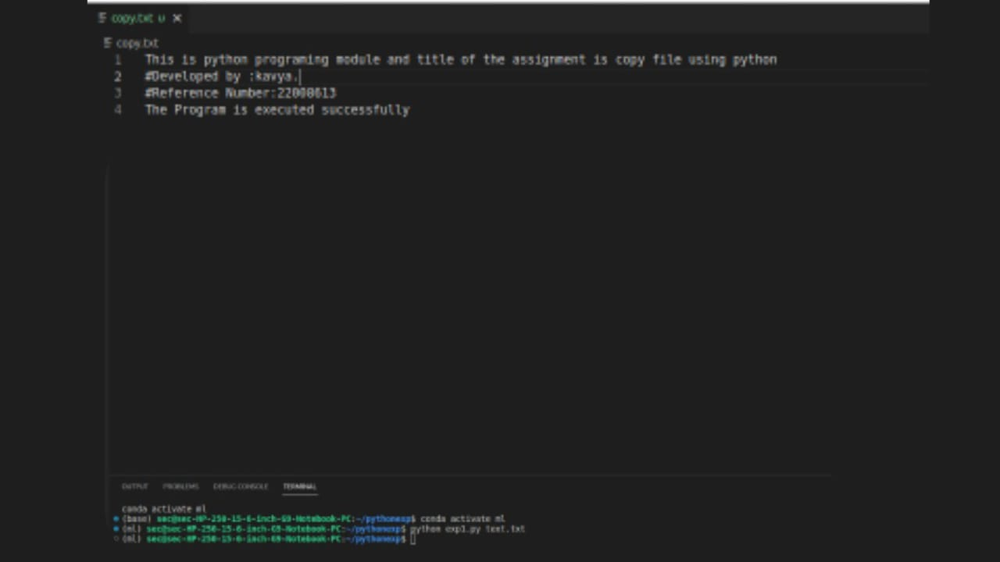

# copy-file
## AIM:
To write a python program for copying the contents from one file to another file.
## EQUIPEMENT'S REQUIRED: 
PC
Anaconda - Python 3.7
## ALGORITHM: 
## Step 1:
Get the file name as the input from the user

## Step 2:
Open the file using the withopen function

## Step 3:
Print the program

## Step 4:
End the program
## PROGRAM:
```python

with open ('f1.txt','r') as firstfile:
with open ('f2.txt','a') as secondfile:
for line in firstfile :
secondfile.write(line)
```
### OUTPUT:



## RESULT:
Thus the program is written to copy the contents from one file to another file.